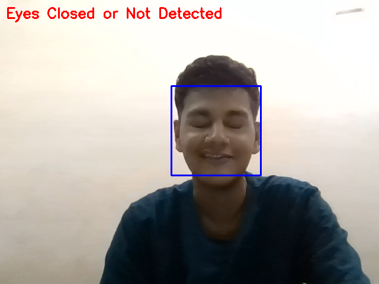

# Real-Time Eye Open/Closed Detection with OpenCV

A simple Python project that uses your laptop’s camera and OpenCV to detect in real time whether your eyes are open or closed - **no complex dependencies required**.

---

## Demo

 
 
---

## Features

- Real-time eye open/closed detection using your webcam
- Lightweight: only requires OpenCV and numpy
- Runs on the latest Python versions (3.8+)
- No dlib or deep learning dependencies

---

## Getting Started

### Prerequisites

- Python 3.8 or newer
- [OpenCV](https://opencv.org/) (`opencv-python`)
- [numpy](https://numpy.org/)

### Installation

1. **Clone this repository:**

git clone https://github.com/your_username/eye-status-detection.git
cd eye-status-detection

2. **Install dependencies:**

pip install opencv-python numpy

---

## Usage

1. **Run the script:**

python eye_status.py

2. **How it works:**
- The webcam window will open.
- The app will display "Eyes Open" or "Eyes Closed or Not Detected" in real time.
- Press `ESC` to exit.

---

---

## Contributing

Contributions are welcome! Please open an issue or submit a pull request for improvements, bug fixes, or new features.

---

## License

Distributed under the MIT License. See `LICENSE` for more information.

---

## Acknowledgements

- [OpenCV](https://opencv.org/) for the computer vision library and Haar Cascades.
- [Best-README-Template](https://github.com/othneildrew/Best-README-Template) for README inspiration.

---

> **Tip:**  
> To add your own images or GIFs, place them in the `images/` directory and update the image links in this README accordingly.

---

**Happy coding!**

